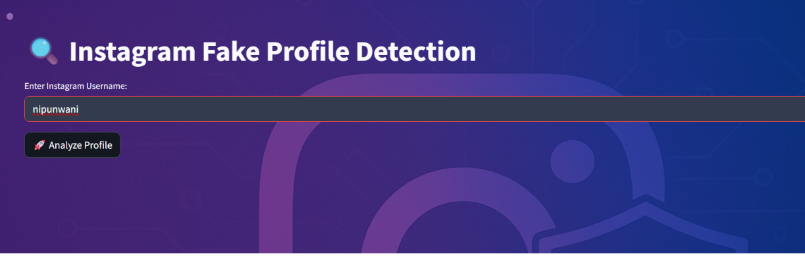
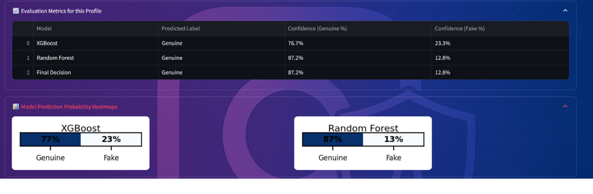

# Fake Social Media Account Detection

## 📌 Project Description
This project detects fake social media accounts using Machine Learning techniques.

## 🚀 Features
- Detect fake vs real accounts
- Machine Learning model (Random Forest / XGBoost)
- Data analysis and prediction

## 🛠️ Technologies Used
- Python
- Pandas, NumPy
- Scikit-learn
- Streamlit (if used)

## ▶️ How to Run
1. Install dependencies:
   pip install -r requirements.txt

2. Run the project:
   streamlit run app1.py

## 📊 Dataset
- Dataset used for training and testing fake accounts

## 📷 Output

